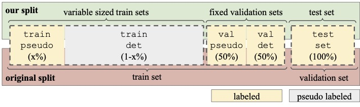

# 3DOpenWorldMOT

## 1. Installation
Create a conda environment from environment file
```
bash setup_conda.sh
conda env create -f environment.yml
```

Install additional packages using
```
bash setup.sh
```

To download Waymo Open Datset also install gsutil (command line tool to download files from google cloud. Follow this Guide to install. After installing the Cloud SDK, simply run gcloud init, then you will be asked to log into your google account. Make sure it is the same account that has Waymo Dataset access.)

Finally, update av2 api by running in your conda environment where ```<conda_path>``` is the place where your anaconda is installed, e.g., ```~/anaconda3/```
```
export conda_path=<conda_path>
cp SeMoLi/av2_update/cuboid.py $conda_path/envs/SeMoLi/lib/python3.8/site-packages/av2/structures/
cp SeMoLi/av2_update/av2_sensor_dataloader.py $conda_path/envs/SeMoLi/lib/python3.8/site-packages/av2/datasets/sensor/
cp SeMoLi/evaluation/av2_evaluation_update/detection/* $conda_path/envs/SeMoLi/lib/python3.8/site-packages/av2/evaluation/detection/
```

## 2. Data Download
The downloaded data will be stored to this directories base directory in the data directory. To set the required environment variable run:
```
export BASE_DIR=$(pwd)
```

To download and convert Waymo Open Dataset run the follwing:
```
cd Waymo_Preparation
bash download_and_extract_all.sh
cd ..
```
This will download the whole tfrecord files, but will only extract the LiDAR data.

To download Argoverse2 dataset run the following:
```
conda install s5cmd -c conda-forge
export BASE_DIR="<base_dir>"
bash download_av2.sh
```
This will only download the lidar data, 3D annotations, and ego vehicle poses of the AV2 dataset. Since camera data is not needed in this project we aviod downloading it.

For SeMoLi and the training of the off-the-shelf detector we follow the dataset split as introduced in the paper:


```x``` corresponds to the percentage used for training the SeMoLi

## 3. Trajectory Estimation
For the trajectory estimation replace ```<split>``` by either train or val and ```<dataset>``` by either waymo or av2 and run the following:
```
cd NTF_lidar/
bash tools/preprocess_pcs_<split>_<dataset>.sh
bash tools/compute_flow_<split>_<dataset>.sh
cd ../
```
Since the trajectory estimation is a rather long process, you can also strart several processes at the same time if you are using a slurm-based system or something similar by specifying the ```from_``` and ```to_``` flags in the preprocssing which refers to the sequence count. Similarly, for the flow computation ```from_``` and ```to_``` flags can be specified.


## 4. SeMoLi

### 4.1. Setting Up SeMoLi
#### Environment Variables:
Set dataset paths as environment variables. For Waymo dataset run:
```
export BASE_DIR=$(pwd)
export TRAJECTORY_DIR=Waymo_Flow
export DATA_DIR=Waymo_Converted
export DATA_TYPE=waymo_traj
export PROCESSED_DIR=Waymo_Point_GT
```

For AV2 run:
```
export BASE_DIR=$(pwd)
export TRAJECTORY_DIR=AV2_Flow
export DATA_DIR=AV2
export DATA_TYPE=argoverse2_traj
export PROCESSED_DIR=AV2_Point_GT
```

#### Generating Ground Truth Files
To generate ground truth information for points, like if a point is moving and to which class it belongs, and bounding boxes run:
```
python tools/get_filtered_gt.py root_dir=$BASE_DIR data=$DATA_TYPE data.data_dir=$BASE_DIR/data/$DATA_DIR 

python tools/get_point_gt.py root_dir=$BASE_DIR training.just_eval=True data=$DATA_TYPE data.trajectory_dir=$BASE_DIR/data/$TRAJECTORY_DIR/trajectories data.data_dir=$BASE_DIR/data/$DATA_DIR data.processed_dir=$BASE_DIR/data/$PROCESSED_DIR data.do_process=True data.detection_set=val_evaluation data.percentage_data_val=1.0

python tools/train.get_point_gt root_dir=$BASE_DIR training.just_eval=True data=$DATA_TYPE data.trajectory_dir=$BASE_DIR/data/$TRAJECTORY_DIR/trajectories data.data_dir=$BASE_DIR/data/$DATA_DIR data.processed_dir=$BASE_DIR/data/$PROCESSED_DIR data.do_process=True data.detection_set=train_all data.percentage_data_val=1.0
```

### 4.2. Evaluate Pseudo-Labels
To evaluate an existing set of pseudo-labels run the following and replce ```<pseudo_label_dir>``` with the directory where the corresponding pseudo-labels are stored:
```
python tools/evaluate.py root_dir=$BASE_DIR data=$DATA_TYPE evaluation.eval_dir=<pseudo_label_dir> evaluation.filter_moving=True evaluation.discard_last_25=True evaluation.inflate_bb=True evluation.use_matched_category=False evaluation.heuristics=False evluation.store_adapted_pseudo_labels=False evaluation.roi_clipping=True
```
The command above uses the default values of all flags. They detemine the folling settings:
- ```filter_moving``` determines if only moving (```evaluation.filter_moving=True```) objects should be evaluated or also static objects (```evaluation.filter_moving=False```)
- ```discard_last_25``` does not evaluate the last 25 timestamps of a given sequence since there are no trajectories predicted for the points in the last 25 timestamps
- ```inflate_bb``` inflates the bounding boxes to have a minimum lenghth, width and height. If the sclaing factor in the evaluation conf file is set to a value different ```>1``` the bounding boxes are additionally scaled by a constant factor.
- ```use_matched_category``` assignes each pseudo-label the category of it's matched ground truth bounding box instead of applying class-agnosting evaluation.
- ```heuristics``` detemines if a simple heuristic should be used to filter very large or very small bounding boxes
- ```store_adapted_pseudo_labels``` stores all pseudo-labels in inflated manner into one file as input for the down stream detector training
- ```roi_clipping``` filters the ground truth as to only contain bounding boxes in a 100mx4m rectangle around the ego vehicle

The pseudo-labels to train the off-the-shelf detector will be stored to ```input_eval/<experiment_name>```. Those pseudo-labels already include inflation and other post-processings if enabled (by default disabled). The orginal detections will be stored under ```out/detections_<detection_split>/<experiment_name>```.

### 4.3. Evaluate SeMoLi to Generate Pseudo-Labels
To generate detections and evaluate trained SeMoLi replace ```<path_to_weight>``` with the path to the weights you want to use and run the following:
```
python tools/train.py root_dir=$BASE_DIR data=$DATA_TYPE training.just_eval=True data.trajectory_dir=$BASE_DIR/data/$TRAJECTORY_DIR/trajectories data.data_dir=$BASE_DIR/data/$DATA_DIR data.processed_dir=$BASE_DIR/data/$PROCESSED_DIR data.percentage_data_val=0.1 data.detection_set=val_gnn models.weight_path=<path_to_weight> evaluation.keep_checkpoint=False evaluation.keep_detections=True
```
For evaluation the default flags as defined above are used and hence not added to the command. For pseudo-label generation the flags determine the following:
- ```just_eval``` determines that SeMoLi should just be evaluated not be trained
- ```detection_set``` determines the data split for which the pseudo-labels should be computed, i.e., ```train_gnn```, ```val_gnn```, ```val_detector```, and ```train_detector```
- ```percentage_data_val``` defines the percentage of data used for validation. Since the validation sets have a fixed size, this is only important if generating pseudo labels, i.e., setting ```data.detection_set=train_detector```. It is definced according to SeMoLi splits, i.e., the percentage corresponds to x in the above figure. Hence if ```x=0.1``` and the split to generate pseudo-labels for is ```train_detector```, the actual percentage of the data used is ```1-0.1=0.9```
- ```keep_checkpoint``` determines if checkpoints should be kept, i.e., for hyperparameter search not wanted
- ```keep_detections``` determines if detections should be kept, i.e., for hyperparameter search not wanted

### 4.4. Train SeMoLi
To train SeMoLi from scratch run the following:
```
python tools/train.py root_dir=$BASE_DIR data=$DATA_TYPE data.trajectory_dir=$BASE_DIR/data/$TRAJECTORY_DIR/trajectories data.data_dir=$BASE_DIR/data/$DATA_DIR data.processed_dir=$BASE_DIR/data/$PROCESSED_DIR data.percentage_data_train=0.1 data.percentage_data_val=0.1 data.detection_set=val_gnn
```
For evaluation and pseudo-label generation flags are defined as above. Additionally for training the following flags are of importance:
- ```percentage_data_train``` determines the percentage of data used for training

Checkpoints will be stored under ```out/checkpoints/<experiment_name>```

### 4.5. Additional Flags
#### Pseudo-Label Generation
You can adapt the pseudo-label generation parameters in ```SeMoLi/conf/detector/default.yaml``` like minimum number of interior points for a pseudo-label to be kept. Additionally, the inflation flags for evaluation can be adapted accordingly in ```SeMoLi/conf/evaluation/default.yaml```. In ```SeMoLi/conf/data/<data_set>.yaml```, the amount of maximum points per point cloud for training and testing can be set as well as filtering of static points for ground truth (used in ```get_filtered_gt```) and training / validation samples based on predicted velocity.

#### Training of SeMoLi
Training parameters, e.g., number of epochs can be set in ```SeMoLi/conf/training/default.yaml``` and ```SeMoLi/conf/ls_scheduler/<scheduler_to_use>.yaml```. In ```SeMoLi/conf/data/<data_set>.yaml```, the amount of maximum points per point cloud for training and testing can be set as well as filtering of static points for ground truth (used in ```get_filtered_gt```) and training / validation samples based on predicted velocity.

#### Parameters of SeMoLi
The parameters of SeMoLi, e.g., number of layers and loss specifications can be defined in ```SeMoLi/conf/models/GNN.yaml```.

## 5. Off-The-Shelf Detector
To train the off the shelf detector on pseudo-labels and evaluate it on the ```val_detector``` set, first go to the detection repository:

```
cd mmdet3d
```

Then, set the evironment variables as the following:

```
export TRAIN_LABELS=<train_label_path>
export VAL_LABELS=$BASE_DIR/SeMoLi/data_utils/Waymo_Converted_filtered/train_1_per_frame_remove_non_move_remove_far_filtered_version_city_w0.feather
```

where ```<train_label_path>``` is the path to the feather file containing the pseudo-labels.

Then run the following to train the detector:
```
./tools/dist_train.sh configs/pointpillars/pointpillars_hv_secfpn_sbn-all_8xb4-2x_waymo-3d-class_specific.py <num_gpus> <percentage_train> 1.0 $TRAIN_LABELS $VAL_LABELS --val_detection_set=val_detector --auto-scale-lr
```
where 
- ```percentage_train``` is the percentage used to train the gnn, i.e., the x value as defined above
- ```num_gpus``` is the number of gpus that will be used for training

The code will automatically evaluate the performance using the evaluation code of SeMoLi returning 3D average precision.

To evaluate on our test set (the real validation set), set 
```
export VAL_LABELS=$BASE_DIR/SeMoLi/data_utils/Waymo_Converted_filtered/val_1_per_frame_remove_non_move_remove_far_filtered_version_city_w0.feather
```

as well as ```val_detection_set=val_evaluation```. If you only want to evaluate, add the ```--eval``` flag:
```
./tools/dist_train.sh configs/pointpillars/pointpillars_hv_secfpn_sbn-all_8xb4-2x_waymo-3d-class_specific.py <num_gpus> <percentage_train> 1.0 $TRAIN_LABELS $VAL_LABELS --val_detection_set=val_evaluator --auto-scale-lr --eval
```

For more details, please refer to the ```README.md``` of the ```mmdetection3D_adapted``` repository.

To only evaluate exsiting detections on our test set (the real validation set) from PointPillars in AV2 format, please run the following from the SeMoLi directory (```$BASE_DIR/SeMoLi```):

```
python tools/evaluate.py root_dir=$BASE_DIR training.just_eval=True data=$DATA_TYPE data.data_dir=$BASE_DIR/data/$DATA_DIR data.trajectory_dir=$BASE_DIR/data/ evaluation.eval_dir=<detection_dir> evaluation.filter_moving=True evaluation.discard_last_25=False evaluation.inflate_bb=False evaluation.use_matched_category=False evaluation.heuristics=False evaluation.store_adapted_pseudo_labels=False evaluation.roi_clipping=True data.percentage_data_val=1.0 data.detection_set=val_evaluation data.processed_dir=$BASE_DIR/data/$PROCESSED_DIR evaluation.filtered_pc_path=$BASE_DIR/data/$FILTERED_DIR
```

